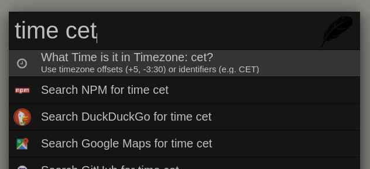
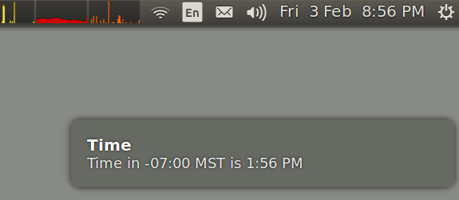

## Zazu Timezone

A simple [zazu](http://zazuapp.org/) plugin which tells what time it is in another timezone.

### Usage

Use the prefix `time` together with an identifier for a timezone:

- `time +03:00`
- `time -5`
- `time CET`
- `time MST`
- `time UTC-5`
- `time in MST`

### Install

Add `avaly/zazu-timezone` inside of `plugins` block of your `~/.zazurc.json` file.

```json
{
  "plugins": [
    "avaly/zazu-timezone"
  ]
}
```

### Screenshots





### Credits:

Logo made by [Freepik](http://www.freepik.com) from [Flaticon](http://www.flaticon.com/) is licensed by [CC 3.0 BY](http://creativecommons.org/licenses/by/3.0/).
